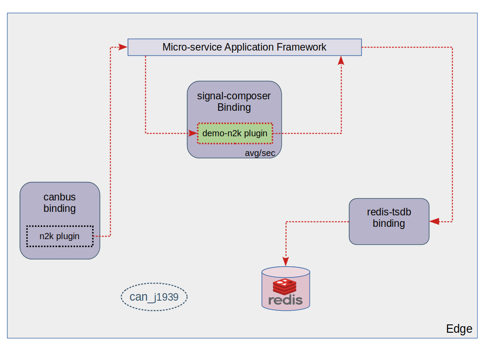

# redpesk® demo-n2k plugin architecture

## Introduction

The signal-composer-plugins-demo-n2k takes place in a demo context which puts in relation:
- sensor which emits can frames
- [canbus-binding](../redpesk-core/canbus/1-Architecture.html)
- [signal-composer-binding](../redpesk-core/signal-composer/part-1/1-Architecture.html)
- [redis-tsdb-binding](../redpesk-core/redis/1-Architecture.html)
- [cloud-publication-binding](../redpesk-core/cloud-pub/1-Architecture.html)

The information you are about to read down below are specifics to the demo that takes place late 2020 for the redpesk showcase, but keep in mind that involved blocks are not frozen and can be modeled to match your expectations (sensor, standard CAN, data processing, etc...)

## Prerequesites

If you want the demo-n2k plugin to be launched in an environment (Target/Host), ensure it contains, and has loaded, the **can_j1939** kernel modules.

## Architecture

The demo-n2k is a signal-composer plugins that is expecting the canbus-binding to emits related wind value. These values are stored in the signal composer and an average is done after each second. From then, a request is sent to the redis-tsdb-binding to store the value.



You can find in the [config.cmake](https://github.com/redpesk-samples/signal-composer-plugins-demo-n2k/blob/master/conf.d/cmake/config.cmake) file, a bunch of crucial variable for the plugin identity such as:
- The name of your plugin: @PROJECT_NAME@
- The name of the sensor you want the plugin to process its data: @DEMO_SENSOR@

The name of the sensor is associated to the data sent to the redis-tsdb-binding in order to facilitated the user request within the database. The format used to forward the data is the **json**.  
Example:  
```json
{
    "class": "WIRED_WIND_WS310",
    "data": {
        "speed": {
            "value": 1.574502,
            "unit": "m/s"
        }
    },
    "timestamp": 1607986220
}
```