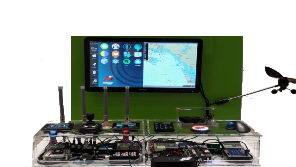
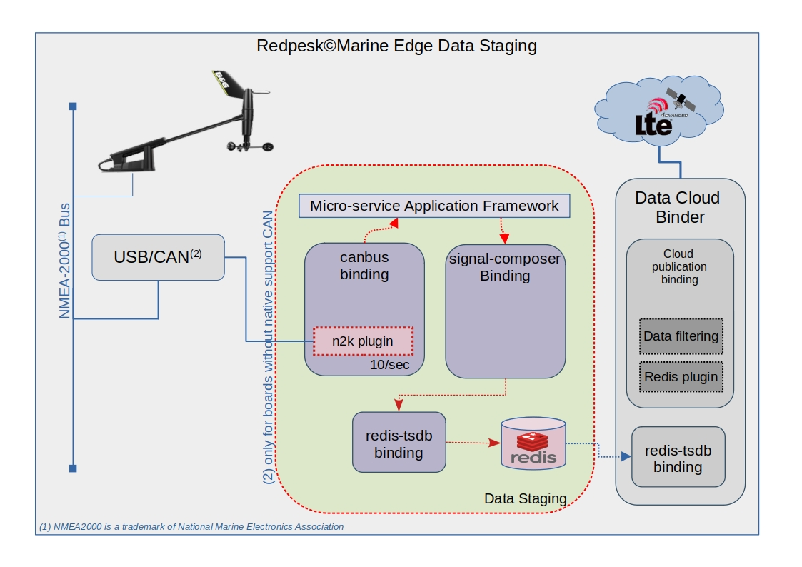
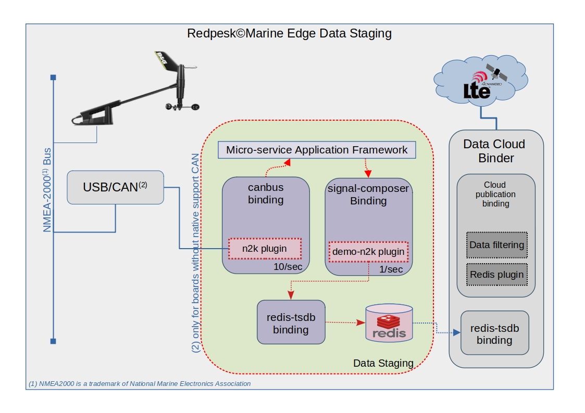
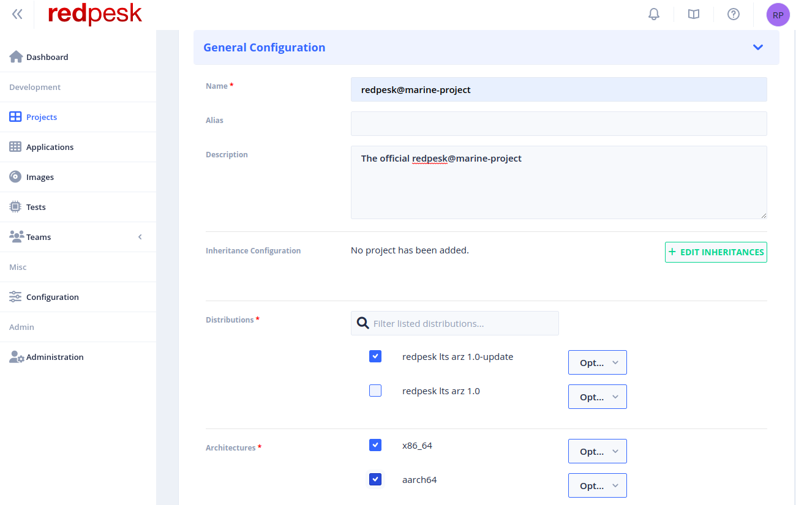
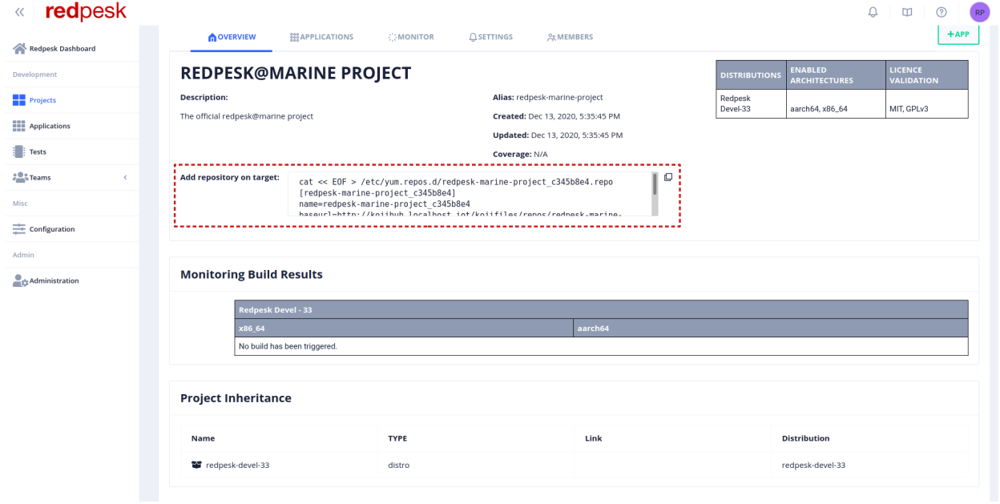
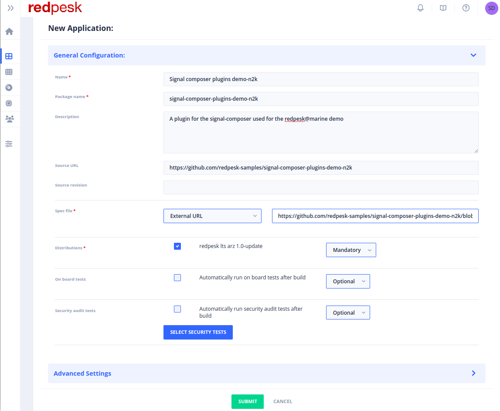
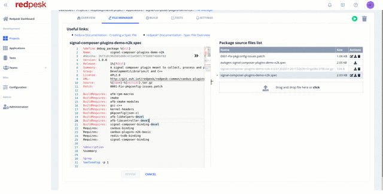

# redpesk@marine demo: from sea to cloud

The redpesk@marine demo is a showcase of how developing in a redpesk® environment can be convenient for continuous integration purpose.

## Introduction
The goal of the demo is, starting from a Wired Wind, to store and access its data, in order to keep an eye on the wind evolution while navigating. 

This demo belongs to a part of what had been presented in the CES2020 show by IoT.bzh. It presents a monitoring application of redpesk, linking several marin sensors, screen and voice recognition to a R-Car-H3 board running a redpesk image.

 

This tutorial will highlight several crucial points in the day to day life of a redpesk® developer, so don't wait any longer and let's start the trip !

{:: style="margin:auto; display:flex; width:50%;"}

## Presentation
### Components
To get further details about the redpesk@marine demo, let's list the hardware components we have:
- A board
    - Raspberry Pi 4
    - Architecture: aarch64
    - OS: redpesk33
- A Wired Wind Sensor WS310:
    - Collects wind speed and wind angle
    - Use NMEA2000 standard to communicate
    - Frequency of =~ 10 data a second

We want the WS310 data to be collected and stored in the cloud. 

To do so, we will need several redpesk related software components:
- [canbus-binding](../../redpesk-core/canbus/1-Architecture.html): CAN frame collection, translation and emission.
- [signal-composer-binding](../../redpesk-core/signal-composer/part-1/1-Architecture.html): data processing
- [redis-tsdb-binding](../../redpesk-core/redis/1-Architecture.html): data storage in a Time Series Database
- [cloud-publication-binding](../../redpesk-core/cloud-pub/1-Architecture.html): @VINCENT PLEASE FILL@

Because the WS310 emits CAN frames which follow NMEA2000 standard, the canbus plugin needs to load the **n2k-basic-signal** plugin in order to achieve the frame translation.


Moreover, your target must have the **can_j1939** kernel module loaded.
### Project
In order to get a more precise vision of the project we are about to deploy in the redpesk image, here is a drawing that may come in handy


## Developer's work

The interesting part, as a developer sight, begins here. Let's say we want to regulate the data that are entering our database because we don't want it to be overcharged with 10 data a second. We could imagine that we put in the average per second of the signals emited by the canbus-binding.

The signal-composer-binding could do the tricks for us since it is a service that can act on input signals by loading plugins that perform actions on them.

Let's say you wrote this plugin and pushed its source code just [there](http://link/to/the/repo/github/demo-n2k).
*Documentation of the [signal-composer-plugins-demo-n2k](../../redpesk-core/1-Architecture.html)*

Let's get the new preview of the architecture project !



Now that the source code is upstream, we can consider building it within the redpesk environment in order to get the project working in the redpesk image deployed in the board.

## Packaging

In order to build the demo-n2k plugin in redpesk, you have two possibilities:
- Use the web user interface, such as the one you can find there: [community](http://community-app.redpesk.bzh/) one.
- Use the [rp-cli](../../getting_started/rp_cli/0_introduction.html) tool to build your project directly from the command line.

This section will present, for each steps, both of them.

### Project creation

Once logged in your redpesk account, let's have a look of how to create the redpesk@marine project.

#### UI

Click on `new project` and let's have a look to the project configuration 



#### rp-cli

```bash
rp-cli projects add -n "redpesk@marine project" -d "The official redpesk@marine project" --mandatory-distro redpesk-devel-33 --mandatory-arch aarch64 --optional-arch x86_64
```

Notice here that we put the aarch64 as a mandatory project architecture since we use a Raspberry Pi 4 as a target.

### Package manager 

Let's assume the Raspberry Pi4 is already running the redpesk33 images, there we have to make available any packages coming from the redpesk@marine project within the board.

#### UI

Just follow the instruction in the `Add repository on target` section and copy/paste/run these lines of code directly in your board.



#### rp-cli

```bash
$ rp-cli projects get redpesk-marine-project --repository
ID                                       Slug                    Name
d6a4b0ca-6ae6-41a3-a373-08d904d9761e     redpesk-marine-project  redpesk@marine project

Repository file:
----------------

cat << EOF > /etc/yum.repos.d/redpesk-marine-project.repo
[redpesk-marine-project]
name=redpesk-marine-project
baseurl=http://lorient-app-test01.lorient.iot/kbuild/repos/redpesk-marine-project_d6a4b0ca--redpesk-devel-33-build/latest/\$basearch
enabled=1
repo_gpgcheck=0
type=rpm
gpgcheck=0
skip_if_unavailable=False
EOF
```
### Application creation

It is time to create the demo-n2k plugin package.  
 In general, before creating an application, be sure to know:
- Where your sources are located
- Where your specfile is located

Because the plugin is used in a demo, the redpesk Team provides you its [specfile](http://link/to/conf.d/packaging/specfile.spec).  
Do not hesitate to use it as a template for your future experiments within the redpesk environment.

⚠️⚠️ The `package name` application must match the `Name` value in your specfile. ⚠️⚠️

#### UI

Click on `new app` and let's have a look on the application configuration 



#### rp-cli

```bash
rp-cli applications add -n signal-composer-plugins-demo-n2k --pkg-name signal-composer-plugins-demo-n2k -a demo-n2k -d "A plugin for the signal-composer used for the redpesk@marine demo" --source-url https://github.com/redpesk-samples/signal-composer-plugins-demo-n2k --ext-specfile-url conf.d/packaging/signal-composer-plugins-demo-n2k.spec -p redpesk-marine-project
```

### Build
The redpesk@marine application has just been created and is ready to be built. Let see how it goes !

#### UI


#### rp-cli

```bash
rp-cli applications build signal-composer-plugins-demo-n2k
```


### Patch

This demo is also the opportunity to present you a nice feature coming along with redpesk. 

We, as developers, know that sometimes mistakes can occurre. Unfortunately we won't help you fix your code, but at least we can let you patch your source and build your package in the blink of an eye.  

#### UI


#### rp-cli

```bash
# Modification of specfile to add the "Patch:   0002-A-random-fix.patch" (cf. GIF here above)
vim ./signal-composer-plugins-demo-n2k.spec
# Send the new spec file
rp-cli applications upload signal-composer-plugins-demo-n2k --file-path ./signal-composer-plugins-demo-n2k.spec
# Send the patch
rp-cli applications upload signal-composer-plugins-demo-n2k --file-path ./0002-A-random-fix.patch
```

## Deployment

### Package installation
Once your build is successful and closed, everything is set to deploy the demo on board.

If it is not already done, [boot](../../getting_started/quickstart/03-boot-images.html) your board with the latest redpesk image. Then do not forget to add your project package repository list as mentioned in the [package manager section](#package-manager) of this tutorial

Refresh your package manager metadata:

```bash
dnf update --refresh
```

Then install the demo-n2k you have built. In this case we call it signal-composer-plugins-demo-n2k. (See application's `package name` or the specfile's `Name`)

```bash
dnf install signal-composer-plugins-demo-n2k
```
### CAN interface
After that, you need to set up your CAN connection in order to get access to the CAN frame within your environment. Let's assume you use usb2can wire to plug your sensor in.  
Once plugged in you should see that a CAN interface has been created.
```bash
devel@redpesk: ~ ip -br a
lo               UNKNOWN        127.0.0.1/8 ::1/128 
can0             DOWN
```

The sensor used during the demo is the Wired Wind WS310, which has a 250000 baud rate. In order to correctly set up the CAN interface, run the following commands:
```bash
ip link set can0 type can bitrate 250000
ip link set up can0
```
Then you should see the following state for your interface:
```bash
devel@redpesk: ~ ip -br a
lo               UNKNOWN        127.0.0.1/8 ::1/128 
can0             UP
```

⚠️⚠️ If you do not have a sensor ⚠️⚠️  
Don't worry, the demo-n2k plugin install a CAN frame log file. It should be located in: `/var/local/lib/afm/applications/signal-composer/var/WS310.log`.  
Then install can-utils:
```bash
dnf install can-utils
```
Set up the CAN interface:
```bash
ip link add dev can0 type vcan
ip link set up can0
```

Play the logfile:
```bash
canplayer -li -I ${PATH_TO_THE_WS310_LOGS} can0=can0
```
Then you can check your sensor is correctly working by reading the frame it sends thanks to the **can-utils** package.
```bash
devel@redpesk: ~ candump can0
can0  09FD0202   [8]  86 D3 00 F2 C3 FA FF FF
can0  09FD0202   [8]  87 CF 00 ED CD FA FF FF
can0  09FD0202   [8]  88 CB 00 6C D7 FA FF FF
can0  09FD0202   [8]  89 C8 00 64 E0 FA FF FF
...
```

### Database configuration
Start the redis service on your board. By default it will store all the data locally.  
See `redis.conf` file to change this behaviour if you need to.
- bind: IP address where your database can be accessed.
- port: The port your database is reading/listening to.

### Start the demo

Start every binding dependencies that come along with your application and that is implied in the demo.

```bash
afm-util start canbus-binding
afm-util start redis-tsdb-binding
afm-util start signal-composer-binding
```

### Results
There we go, the demo is deployed. To ensure everything is going well, you can see your stored data by using the redis-cli tool. Do not hesitate to read the [demo-n2k](../../redpesk-core/1-Architecture.html) documentation to get in touch with the data structure given to the redis-tsdb-binding.

See the latest stored value:

```bash
devel@redpesk: ~ redis-cli -c TS.MGET FILTER class=WIRED_WIND_WS310
1) 1) "WIRED_WIND_WS310.angle.unit"
   2) (empty list or set)
   3) 1) (integer) 1607986214
      2) "rad"
2) 1) "WIRED_WIND_WS310.angle.value"
   2) (empty list or set)
   3) 1) (integer) 1607986214
      2) 4.110031
3) 1) "WIRED_WIND_WS310.speed.unit"
   2) (empty list or set)
   3) 1) (integer) 1607986214
      2) "m/s"
4) 1) "WIRED_WIND_WS310.speed.value"
   2) (empty list or set)
   3) 1) (integer) 1607986214
      2) 1.669649
```

See the whole content of the class `WIRED_WIND_WS310` in database:
```bash
devel@redpesk: ~ redis-cli -c TS.MRANGE - + FILTER class=WIRED_WIND_WS310
WIRED_WIND_WS310.angle.unit

1608025189
rad
1608025190
rad
...
WIRED_WIND_WS310.angle.value
1608025189
5.238482
1608025190
4.971481
...
WIRED_WIND_WS310.speed.unit
1608025189
m/s
1608025190
m/s
...
WIRED_WIND_WS310.speed.value
1608025189
1.657273
1608025190
1.543333
```
